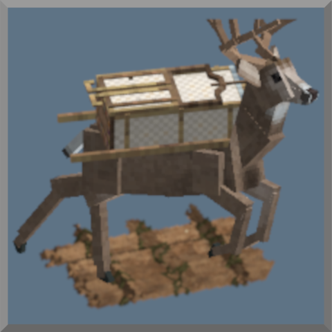

# GlideView



This vintage story mode will switch to third person view when gliding, riding elk or sailing boat
then switch back to first person view upon landing, or unmounting elk/boat

For now you can still control the camera manually, but the on/off will still happen
the camera modes can be configured within glideview.json
```
{
  "default_view": "first", # "first is for first person"
  "elk_view": "overhead", # "first is the thrid person with free cam"
  "boat_view": "first",
  "glide_view": "overhead",
  "other_mount_view": "third",
  "sit_view": "overhead",
  "sit_pitch": -20 # here this is in degree where -90 is looking down 0 is the horizon and 90 looking straight up
}
```

It may be weird to explain so this is a demo of the mod triggering when sit, but only when looking at specific angle

